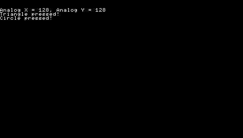
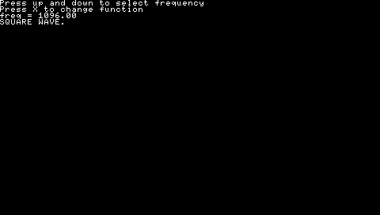
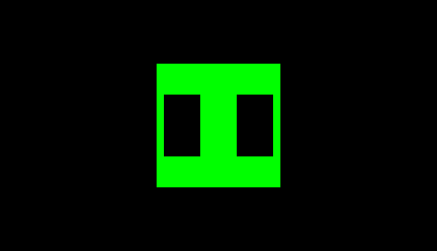

# Basic Programs
{: .fs-8 .fw-700 .text-center }

## Hello world
{: .fs-6 .fw-700 }


> This is a simple Hello World program for the PSP.

Click on the details below to see the code and how to build it.

<details markdown="1">

<summary>View source</summary>

**main.c**

```c

```


**CMakeLists.txt**

```cmake

```

Building can be done with:

```shell
mkdir build && cd build
psp-cmake ..
make
```

This will result in an EBOOT.PBP file in the build directory. Put it in a directory in ms0:/PSP/GAME/ and the PSP can run it.

</details>

## Drawing shapes
{: .fs-6 .fw-700 }


> This is a simple square drawn on the PSP. It uses the native libgu library. 

Click on the details below to see the code and how to build it.

<details markdown="1">

<summary>View source</summary>

**main.c**

```c

```

**CMakeLists.txt**

```cmake

```

Building can be done with:

```shell
mkdir build && cd build
psp-cmake ..
make
```

<p>This will result in an EBOOT.PBP file in the build directory. Put it in a directory in ms0:/PSP/GAME/ and the PSP can run it.</p>

More libgu examples can be found <a href="https://github.com/pspdev/pspsdk/tree/master/src/samples/gu">here</a>.

</details>

## Controller
{: .fs-6 .fw-700 }



> This is a simple program to use the PSP's input functions.

Click on details below to see the code and how to build it.

<details markdown="1">

<summary>View source</summary>

**main.c**

```c

```

**CMakeLists.txt**

```cmake

```

Building can be done with:

```shell
mkdir build && cd build
psp-cmake ..
make
```

<p>This will result in an EBOOT.PBP file in the build directory. Put it in a directory in ms0:/PSP/GAME/ and the PSP can run it.</p>

</details>

## Audio
{: .fs-6 .fw-700 }



> This is a simple program to use the audio of the PSP with minimal effort. It uses native audio library. 

Click on the details below to see the code and how to build it.

<details markdown="1">

<summary>View source</summary>

**main.c**

```c

```

**CMakeLists.txt**

```cmake

``````

Building can be done with:

```shell
mkdir build && cd build
psp-cmake ..
make
```

<p>This will result in an EBOOT.PBP file in the build directory. Put it in a directory in ms0:/PSP/GAME/ and the PSP can run it.</p>

More audiolib examples can be found <a href="https://github.com/pspdev/pspsdk/tree/master/src/samples/audio">here</a>.

</details>

## Using SDL2
{: .fs-6 .fw-700 }


> SDL2 is a library which handles system specific things like input, audio and window management for you. It can also be used to render shapes and images, just like the native libgu. This will be slower, but will result in code that can be run more easily on multiple platforms. 

Click on details below for the to see the code and how to build it.

<details markdown="1">

<summary>View source</summary>

**main.c**

```c

```

**CMakeLists.txt**

```cmake

``````

Building can be done with:

```shell
mkdir build && cd build
psp-cmake ..
make
```

<p>This will result in an EBOOT.PBP` file in the build directory. Put it in a directory in ms0:/PSP/GAME/ and the PSP can run it.</p>

If you have sdl2 dev package and a compiler installed this code will also build on Linux for Linux by running:

```shell
mkdir build && cd build
cmake ..
make
```

More documentation on SDL can be found <a href="http://wiki.libsdl.org/FrontPage">here</a>.

</details>

## Using SDL2 mixer
{: .fs-6 .fw-700 }



> This is a simple program to use the SDL2_mixer library. It handle audio playback in multimedia applications and games. It supports various audio formats(MP3/OGG).

Click on details below to see the code and how to build it.

<details markdown="1">

<summary>View source</summary>

**main.c**

```c

```

**CMakeLists.txt**

```cmake

``````

Building can be done with:

```shell
mkdir build && cd build
psp-cmake ..
make
```

This will result in an EBOOT.PBP file in the build directory. Put it in a directory in ms0:/PSP/GAME/ and you need an audio file to test the program, download it from <a href="/resources/test.ogg">here</a>. Put it in a directory in ms0:/MUSIC/ and then rename the audio file same as name on your *MUSIC_PATH* macro in your C code and the PSP can run it.

</details>

## Using SDL2 ttf
{: .fs-6 .fw-700 }


> This is a simple program to use the SDL2_ttf library. It provides functionality for rendering TrueType fonts for your PSP.

Click on details below to see the code and how to build it.

<details markdown="1">

<summary>View source</summary>

**main.c**

```c

```

**CMakeLists.txt**

```cmake

``````

Building can be done with:

```shell
mkdir build && cd build
psp-cmake ..
make
```

This will result in an EBOOT.PBP file in the build directory. Put it in a directory in ms0:/PSP/GAME/ and you need a font file to test the program, download it from <a href="/resources/Pacifico.ttf">here</a>. Put it in a directory same as EBOOT.PBP and the PSP can run it.

</details>

For more samples, go [here](https://github.com/pspdev/pspsdk/tree/master/src/samples).

## Debugging

When making changes to the example programs listed above, you might run into errors or even crashes. To learn how to figure out what went wrong, check out the [debugging](debugging.html) page.
