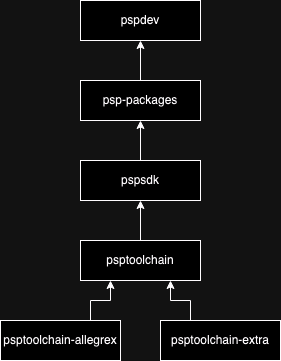

# Contributing
{: .fs-8 .fw-700 .text-center }

There are many ways to contribute to our efforts to make developing homebrew for the PlayStation Portable (PSP) easier for everyone. The first step would be to [join our Discord](https://discord.gg/bePrj9W)!

## Ways to contribute

Before making any contribution, it's best to talk about what you want to do on [Discord](https://discord.gg/bePrj9W). After that, here are some places you can look to contribute:

- Found an bug or are you missing something? Report it [here](https://github.com/pspdev/pspdev/issues)!
- Want to solve a bug? Find our bug tracker [here](https://github.com/issues?q=is%3Aopen+is%3Aissue+archived%3Afalse+user%3Apspdev+)!
- Want to add a library? Find out how to [here](https://github.com/pspdev/psp-packages/blob/master/CONTRIBUTING.md)!
- Want to add a function? Look [here](https://github.com/pspdev/pspsdk)!

Pull requests are always welcome!

## Where can I find the code?

The PSPDEV toolchain is build using quite a few different repositories which each add their own piece to the system. If you just want to build everything at once, the [pspdev repository](https://github.com/pspdev/pspdev) is the place to go.

There are automated builds, which build each part individually if there are changes. Here is a basic image showing the build order:

Lets go over what each repository in this list does and where they get the things they build from:

- [psptoolchain-allegrex](https://github.com/pspdev/psptoolchain-allegrex) contains scripts to build the following tools:
    - [binutils and gdb](https://github.com/pspdev/binutils-gdb) provide supporting tools for debugging, linking and building software.
    - [gcc](https://github.com/pspdev/gcc) is the compiler used for building homebrew.
    - [newlib](https://github.com/pspdev/newlib) is the C library used in PSPDEV, providing many posix functions.
    - [pthread](https://github.com/pspdev/pthread-embedded) is a multithreading library used by `std::thread` in C++ among other things.
- [psptoolchain-extra](https://github.com/pspdev/psptoolchain-extra) contains scripts to build the following tools:
    - [psp-pacman](https://github.com/pspdev/psp-pacman) is the package manager for installing and updating libraries.
    - [psp-cmake](https://github.com/pspdev/psptoolchain-extra/blob/main/patches/psp-cmake) is a wrapper script for cmake using the psp toolchain file.
    - [psp-pkg-config](https://github.com/pspdev/psptoolchain-extra/blob/main/patches/psp-pkg-config) is a wrapper script for pkg-config for libraries in PSPDEV.
- [psptoolchain](https://github.com/pspdev/psptoolchain) builds [psptoolchain-allegrex](https://github.com/pspdev/psptoolchain-allegrex) and [psptoolchain-extra](https://github.com/pspdev/psptoolchain-extra) combines them.
- [pspsdk](https://github.com/pspdev/pspsdk) contains all the PSP specific libraries that we consider to be part of the base system. A lot of functions offered by the official PSP SDK from Sony are also provided here. It also contains [samples](https://github.com/pspdev/pspsdk/tree/master/src/samples) for how to use these functions.
- [psp-packages](https://github.com/pspdev/psp-packages) contains build files for all the 3rd party libraries that are supported by PSPDEV. There are over 50 of them, including SDL2, curl, OpenGL, sqlite, lua and openal to just name a few.
- [pspdev](https://github.com/pspdev/pspdev) combines everything listed above to get the full build of the PSPDEV SDK.

Pull requests for any repository are always appreciated! Have fun contributing and don't forget to say hi on [Discord](https://discord.gg/bePrj9W)!