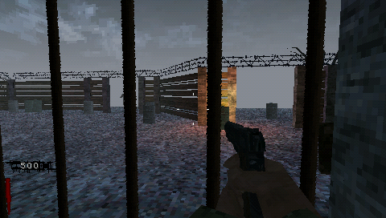
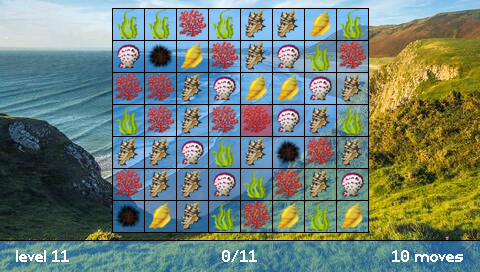
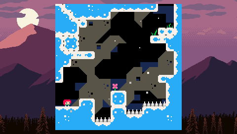

{: .text-center }

# Welcome to PSPDEV
{: .fs-8 .fw-700 .text-center .lh-0 }

# The PSP SDK for Homebrew
{: .fs-6 .fw-700 .text-center }

PSPDEV is an open source software development kit (SDK) for PlayStation Portable (PSP) development. It allows you to make apps and games for both custom and official firmwares. **This is a community project made by enthusiasts, it is in no way affiliated with Sony**.
{: .fs-5 .text-center }

# Getting started
{: .fs-6 .fw-700 }

Install our open source [PlayStation Portable Software Development Kit](installation.html).
{: .fs-5 }

Already have the PSP SDK installed? Dive in and [get started with PSP SDK Homebrew development](how_to_use.html).
{: .fs-5 }

Need some inspiration? Check out our [PSP SDK examples](basic_programs.html).
{: .fs-5 }

Is your code is not working? [Debug it using the PSPLink](debugging.html).
{: .fs-5 }

Want to improve your PSP SDK homebrew development experience? Get some [tips and tricks here](tips_tricks.html).
{: .fs-5 }

# Contact Us
{: .fs-6 .fw-700 }

If you have ideas, suggestions or questions, please don't hesitate to use our [PSPDEV GitHub Discussions](https://github.com/pspdev/pspdev/discussions).
{: .fs-5 }

If you need help or would like to contribute, don't hesitate to join us on [Discord](https://discord.gg/bePrj9W) or open an issue on [GitHub](https://github.com/pspdev/pspdev/issues). See you there!
{: .fs-5 }

# Made with PSP SDK from PSPDEV community <3
{: .fs-6 .fw-700 }

|  |
{: .text-center }

|  |
{: .text-center }

|  |
{: .text-center }

And so much more!
{: .text-center }
