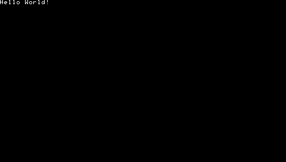

# Quickstart
{: .fs-10 .fw-700 .text-center }

## Installing the toolchain
{: .fs-8 .fw-700 }

### Dependencies
{: .fs-6 .fw-700 }

The PSPDEV toolchain requires a couple of dependencies to be installed before use.

#### Windows(WSL)
{: .fs-4 .fw-700 }

On Windows it is advised to use Ubuntu on Microsoft's WSL system. To set it up run the following commands in a Powershell window started as administrator:

```powershell
wsl --install
```

Now run bash and run the following commands to install the dependencies:

```shell
sudo apt-get update
```

```shell
sudo apt-get install build-essential cmake pkgconf libreadline8 libusb-0.1 libgpgme11 libarchive-tools fakeroot
```

Going forwards, all commands will be run within bash. The filesystem of your Ubuntu installation can be accessed by opening the network location `\\wsl$`.

#### Ubuntu
{: .fs-4 .fw-700 }

On Ubuntu run the following commands to install the dependencies:

```shell
sudo apt-get update
```

```shell
sudo apt-get install build-essential cmake pkgconf libreadline8 libusb-0.1 libgpgme11 libarchive-tools fakeroot
```

#### MacOS
{: .fs-4 .fw-700 }

On MacOS make sure to install [Brew](https://brew.sh/) first, then run the following commands to install the dependencies:

```shell
brew install cmake pkgconf gnu-sed bash openssl libtool libarchive gettext texinfo bison flex isl gsl gmp mpfr
```

#### Docker
{: .fs-4 .fw-700 }

PSPDEV has its own [Docker container](https://hub.docker.com/r/pspdev/pspdev) for the toolchain, follow the steps below to set it up.

### Toolchain 
{: .fs-6 .fw-700 }

To install the PSPDEV toolchain, first [download the latest version](https://github.com/pspdev/pspdev/releases/tag/latest) for your system. Extract it into your user's home directory, which would be `\\wsl$\home\username` on Windows, otherwise `~`. If you're on Windows, pick the Ubuntu build.

Now set the required environment variables. On Mac edit the ``~/.zprofile`` on Linux/WSL the ``~/.bashrc`` file. Add the following at the bottom:

```shell
export PSPDEV=~/pspdev
```

```shell
export PATH=$PATH:$PSPDEV/bin
```

This can simply be done with `nano ~/.bashrc` (`~/.zprofile` on Mac). To save press `Ctrl`+`X`, then press `Y`, then enter/return twice. After that run `source ~/.bashrc` to apply the changes.

On MacOS, run `sudo xattr -rd com.apple.quarantine $PSPDEV` to prevent Gatekeeper from blocking the toolchain.

That's it, now the PSPDEV toolchain can be used to build PSP software. Check out [Coding](#coding) section below for the sample code and how to run it. For testing on real hardware, check out [psplink](https://pspdev.github.io/psplinkusb/).

### Toolchain in Docker
{: .fs-6 .fw-700 }

First, install the docker using the guide from [here](https://docs.docker.com/engine/install/).

If you have succesfully installed, then you have to run:

```shell
docker pull pspdev/pspdev:latest
```

Then you can open the terminal in the directory where you have your code(e.g `/source`) and do something like this:

```shell
docker run -ti -v .:/source pspdev/pspdev:latest
```

After that you can cd into the `/source` directory and your pspdev toolchain is ready to use!

## Coding
{: .fs-8 .fw-700 }

### Hello world
{: .fs-6 .fw-700 }



> This is a simple Hello World program for the PSP. 

Click on the details below to see the code and how to build it.

<details markdown="1">

<summary>View source</summary>

```c

```

**CMakeLists.txt**

```cmake

```

Building can be done with:

```shell
mkdir build && cd build
psp-cmake ..
make
```

This will result in an EBOOT.PBP file in the build directory. Put it in a directory in ms0:/PSP/GAME/ and the PSP can run it.

</details>

For more examples of programs take a look at the [Basic Programs](basic_programs.html) page.
